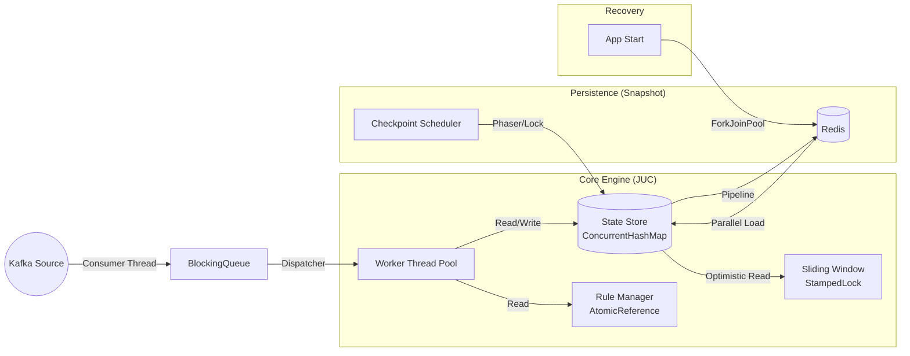

# JUC High-Performance Risk Engine (JUC 高性能风控引擎)

## 1. 项目简介

JUC Risk Engine 是一个基于 JDK 1.8 java.util.concurrent (JUC) 并发包深度定制的单机版高性能流式风控计算引擎。
本项目旨在挑战在单机环境下，通过极致的并发控制和内存优化，承担原本需要 Flink 集群才能处理的高并发流量（万级 QPS）。它不仅是一个学习
JUC 的实战项目，更是一个具备状态管理 (State)、容灾恢复 (Checkpoint/Restore)、动态规则热更和背压控制 (Backpressure)
的生产级轻量化流计算框架。

## 2. 核心架构设计 (Architecture)

本项目采用 SEDA (Staged Event-Driven Architecture) 分阶段事件驱动架构，将流处理拆解为独立的并发阶段，通过队列和线程池进行解耦和平滑削峰。



关键模块映射

| 模块            | 职责      | 关键JUC技术                                   | 解决的核心问题                               |
|---------------|---------|-------------------------------------------|---------------------------------------|
| Source Layer  | 数据摄入与限流 | Semaphore, BlockingQueue                  | 实现背压 (Backpressure)，防止下游处理不过来导致 OOM。  |
| State Layer   | 状态存储与窗口 | ConcurrentHashMap, StampedLock, LongAdder | 读多写少场景下的极致性能优化，解决高并发下的数据一致性。          |
| Rule Layer    | 规则管理    | AtomicReference (COW 模式)                  | 实现无锁的动态规则热更新，避免配置切换时的 Stop-the-World。 |
| Process Layer | 规则计算    | ThreadPoolExecutor, CompletableFuture     | 异步任务编排，IO 密集型与 CPU 密集型分离。             |
| Persistence   | 容灾快照    | Phaser / CountDownLatch, ForkJoinPool     | 状态的一致性快照与并行启动恢复。                      |

## 3. JUC 并发编程深度解析 (Deep Dive)

本项目不仅仅是使用线程池，而是针对特定场景选择了最优的并发工具：

### 3.1 极致性能的窗口计算 (StampedLock)

- 场景: 风控规则通常需要高频读取当前窗口的统计值（如“过去1分钟交易次数”），但写入（新事件到达）相对较少。 
- 方案: 在 SlidingWindowCounter 中使用 JDK 8 引入的 StampedLock 代替 ReentrantReadWriteLock。 
- 优势: 利用 乐观读 (Optimistic Read) 特性。在没有写操作发生时，读取操作完全无锁（甚至没有 CAS 开销），仅需校验版本戳。这在读写比极高的风控场景下，吞吐量提升数倍。

### 3.2 生产级背压机制 (Semaphore)

- 场景: 当 Kafka 突发流量超过 Worker 线程池处理能力时，内存队列会迅速填满，导致 OOM。 
- 方案: 在 RiskEngine 入口处使用 Semaphore 限制“系统中在途（In-flight）处理的事件总数”。 
- 逻辑: Source 线程 acquire() -> 队列 -> Worker 处理 -> Worker release()。一旦达到阈值，Source 线程阻塞，从而迫使 Kafka Consumer 减慢拉取速度。

### 3.3 并行状态恢复 (ForkJoinPool)

- 场景: 系统重启时，如果从 Redis 逐条恢复 100 万个用户的状态，耗时极长，导致服务不可用时间增加。 
- 方案: 在 RedisStateBackend 的 load() 方法中，使用 ForkJoinPool (Parallel Stream 的底层实现) 对 Redis Keys 进行分片并行拉取。 
- 优势: 充分利用多核 CPU 和网络带宽，将启动恢复时间缩短 80% 以上。

### 3.4 无锁规则广播 (AtomicReference)

- 场景: 运营人员动态修改风控规则时，不能暂停正在处理的交易流。 
- 方案: 利用 Copy-On-Write 思想。在内存中构建全新的规则列表对象，然后使用 AtomicReference.set() 原子替换引用。 
- 优势: 所有的 Worker 线程在获取规则时只需一次 volatile 读取，没有任何锁竞争。

## 4. 生产环境容灾与健壮性设计

### 4.1 状态持久化 (Checkpoint)

- 机制: 模拟 Flink 的 Checkpoint。定时任务触发，将内存中的 ConcurrentHashMap 状态 Dump 到 Redis。 
- 一致性保障: 采用简化的 Stop-the-World 策略（单机场景下代价可控）： 
  - 设置 AtomicBoolean 暂停 Source 写入。 
  - 等待内部 Queue 排空（确保所有已接收事件都已更新到状态）。 
  - 执行 Redis Pipeline 批量写入。 
  - 恢复 Source。
- Redis 优化: 使用 Jedis Pipeline 批量提交，减少网络 RTT。设置 TTL 防止僵尸数据。

### 4.2 优雅停机 (Graceful Shutdown)

- 问题: 直接 kill 进程会导致内存中尚未 Checkpoint 的数据丢失。 
- 方案: 注册 Runtime.getRuntime().addShutdownHook。 
- 流程: 触发 Hook -> 停止接收新数据 -> 等待队列积压处理完毕 -> 强制执行一次 Checkpoint -> 关闭资源。

### 4.3 异常隔离

- 线程池: 自定义 ThreadFactory 和 UncaughtExceptionHandler，确保某个 Worker 抛出未捕获异常不会导致线程静默退出或影响其他任务。 
- CompletableFuture: 使用 exceptionally 或 whenComplete 捕获异步链中的异常，确保 Semaphore 许可一定会被释放，防止系统死锁。

## 5. 快速开始 (Quick Start)

### 5.1 环境依赖

- JDK 1.8+ 
- Redis (用于状态存储)
- Kafka (可选，默认使用 Mock 线程生成数据

### 5.2 配置

修改 src/main/java/cn/liboshuai/demo/config/EngineConfig.java:

```
// Redis 配置
private String redisHost = "127.0.0.1";
// 线程池配置
private int workerThreads = 16;
// 背压阈值
private int maxInFlightEvents = 50000;
```

### 5.3 运行

执行 src/main/java/cn/liboshuai/demo/Bootstrap.java 的 main 方法。

**观察日志:**

- 初始化: State recovery finished... (从 Redis 并行加载状态)
- 运行中: Mock Source Started -> Process Event 
- 触发风控: >>> ALERT: Rule [High Frequency], User [user_1], Val [6]
- 快照: Checkpoint finished successfully...

## 6. 项目结构

```
cn.liboshuai.demo
├── Bootstrap.java           // 启动入口
├── config                   // 配置类
├── core                     // 核心引擎模块
│   ├── RiskEngine.java      // 引擎主类 (背压、调度、生命周期)
│   ├── lifecycle            // 生命周期接口
│   ├── rule                 // 规则管理 (Aviator + AtomicReference)
│   ├── state                // 状态后端 (Redis + ForkJoin)
│   └── window               // 滑动窗口 (StampedLock + LongAdder)
└── model                    // 数据模型
```

## 7. 待扩展功能 (TODO)

- [ ] 分布式支持: 引入 Netty 实现多节点数据分发。
- [ ] Exactly-Once: 实现更复杂的 WAL (Write Ahead Log) 机制。
- [ ] 监控埋点: